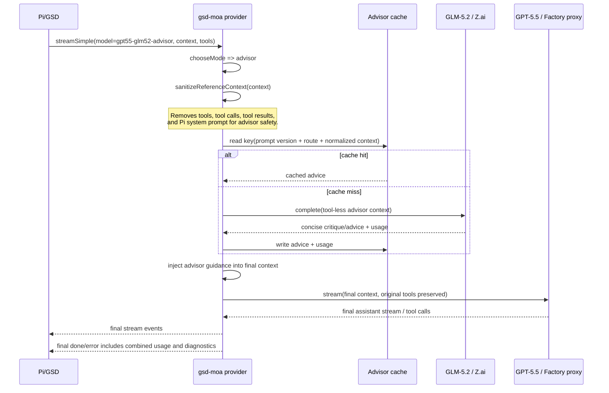

# Advisor Mode Flow

Current `gpt55-glm52-advisor` execution path:

```mermaid
flowchart TD
  A[Pi/GSD calls provider gsd-moa<br/>model: gpt55-glm52-advisor] --> B[streamGsdMoa]
  B --> C[load .pi/gsd-moa.json]
  C --> D[chooseMode]
  D -->|advisor| E[buildAdvisorContext]
  E --> F[sanitizeReferenceContext<br/>drop tools, tool calls, tool results,<br/>and Pi system prompt]
  F --> G{advisor cache hit?}
  G -->|yes| H[reuse cached GLM advice<br/>usage not charged again]
  G -->|no| I[GLM-5.2 reference call<br/>Z.ai Coding Plan<br/>tool-less complete()]
  I --> J[write advisor cache]
  H --> K[withAdvisorGuidance]
  J --> K
  K --> L[final GPT-5.5 acting call<br/>Factory Codex proxy<br/>normal Pi tools preserved]
  L --> M[stream final assistant events to Pi]
  M --> N[done/error event gets<br/>combined usage + gsd-moa.details]
```



## Current route assumptions

- Primary: Factory local Codex proxy, `http://127.0.0.1:8317/v1`, model `gpt-5.5`, env `FACTORY_GPT_API_KEY`.
- Reference: Z.ai Coding Plan endpoint, `https://api.z.ai/api/coding/paas/v4`, model `glm-5.2`, env `ZAI_API_KEY`.

## Safety invariant

Only the final GPT-5.5 acting call receives Pi tools. GLM-5.2 is a private, tool-less advisor and cannot act on the filesystem or request tool execution.
