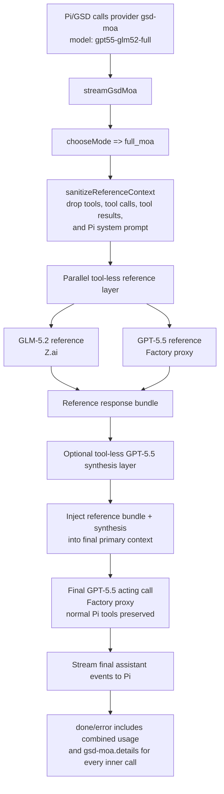
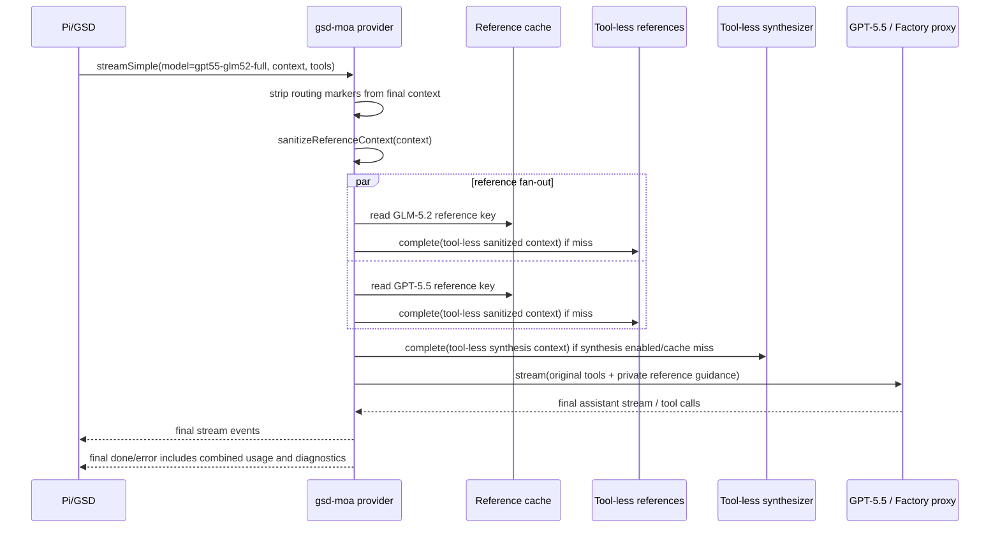

# Full MoA Flow

`gpt55-glm52-full` follows the Hermes/OpenRouter Model Fusion shape: run multiple tool-less reference models over the same sanitized conversation, optionally synthesize their outputs, then let one final GPT-5.5 acting call use normal Pi tools.

## Default reference portfolio

- `glm52`: GLM-5.2 through the configured Z.ai reference route.
- `gpt55`: GPT-5.5 through the configured Factory proxy route.
- `synthesis`: GPT-5.5 through the Factory proxy, tool-less, summarizing reference responses into actionable guidance for the final actor.
- `primary`: GPT-5.5 through the Factory proxy, tool-capable, owns all file/terminal actions.

The reference models receive the same sanitized conversation rather than role-specific architect/reviewer/implementer prompts. Diversity comes from model differences first; GSD-specific behavior belongs primarily in `auto` routing, which decides when full MoA is worth the overhead.

Individual reference and synthesis routes can be overridden under `.pi/gsd-moa.json` using `fullMoa.proposers[].route` or `fullMoa.synthesis.route`.

## Safety invariant

Full MoA expands judgment diversity, not autonomous writers. Reference models and the synthesizer are private and tool-less. Only the final primary model receives Pi tools and may act.
