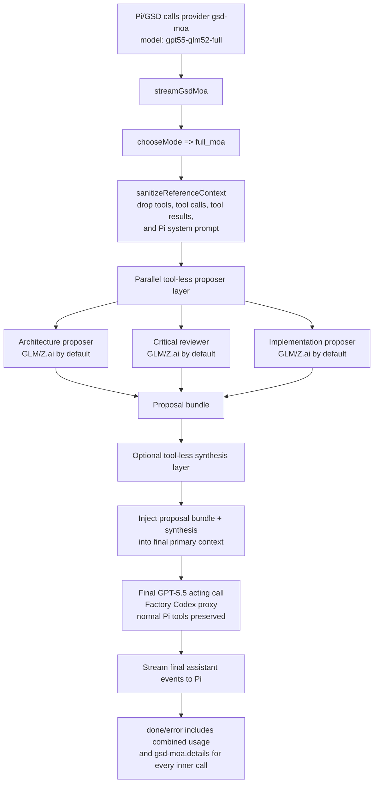
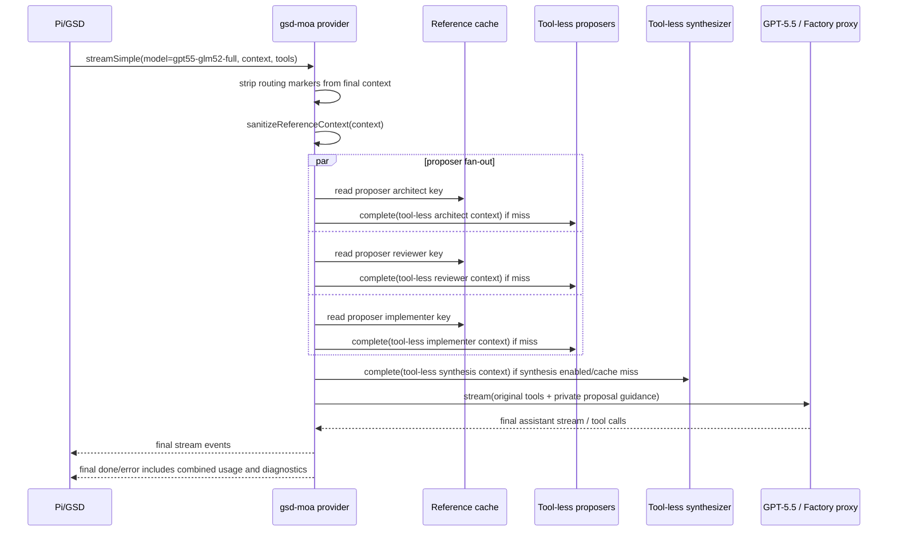

# Full MoA Flow

`gpt55-glm52-full` expands judgment diversity while preserving the single-writer tool boundary.

## Default proposer roles

- `architect`: robust plan, boundaries, sequencing, tradeoffs.
- `reviewer`: bugs, missing requirements, risks, and tests.
- `implementer`: concrete implementation path, edge cases, verification.

Each proposer defaults to the configured reference route. Individual proposer and synthesis routes can be overridden under `.pi/gsd-moa.json` using `fullMoa.proposers[].route` or `fullMoa.synthesis.route`.

## Safety invariant

Full MoA expands judgment diversity, not autonomous writers. Proposers and the synthesizer are private, tool-less reference calls. Only the final primary model receives Pi tools and may act.
